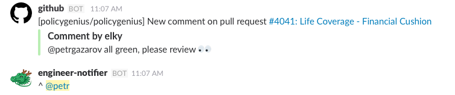

# Engineer Notifier! :dragon_face:

A hack to improve Github-Slack notifications. 

### Problem
When a comment is posted on Github PR, you get a post to your slack channel by Github bot if you installed the integration.
Slack does not notify you when you or someone in your team is mentioned in the comment exlicitly, e.g. `@your_gh_handle CR please?`, because the mention comes inside `attachments` attribute of incoming JSON.

### Solution
This bot will repost to channel mentioning the appropriate party and triggering slack notification.

### Environment variables

* SLACK_API_TOKEN
  * Bot token issued by Slack, obtainable [here](https://api.slack.com/docs/oauth-test-tokens)

* MENTIONS_TO_HANDLES
  * Hash where keys are mentions on github and values are slack handles.
  * Note that slack handles need to be formatted for bots
    * Slack user handle example: `@U0EXLJ7RM`
    * Slack subteam handle example: `!subteam^S0DPXCWRD`
    * [See more on slack formatting](https://api.slack.com/docs/formatting)
  * When setting this environment variable, hash should be a string with single quotes outside and double quotes inside, e.g. `'{"@kelly": "@SDFHJ23G", "@brad": "@DFD3H4M"}'`

* CHANNEL_IDS
  * Array of valid channel ids, obtainable [here](https://api.slack.com/methods/channels.list)
  * Set it same way as the above hash, e.g. `'["DFJDH3H2", "NSBA2FB3"]'`

* BOT_EMOJI
  * `:dragon_face:` by default
  
### Contributing
Contributions are welcome. Please check [Issues](https://github.com/petrgazarov/engineer-notifier/issues) for existing bugs/feature requests or add a new issue.

#### Built on top of the awesome [slack-ruby-bot](https://github.com/dblock/slack-ruby-bot)
